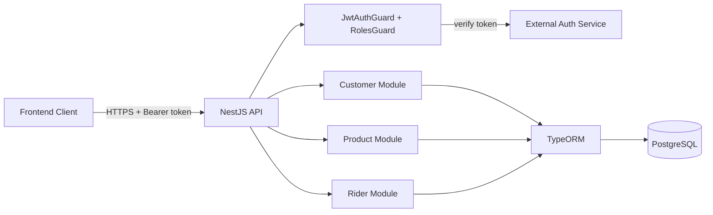

<div align="center">

# moveToYou Backend


**A NestJS and PostgreSQL REST API for managing daily delivery operations: customers, riders, products, delivery routes, and zones.**

<!-- TODO: screenshot/GIF - add an API demo (Swagger UI or a Postman request/response) once available -->

</div>

> Status: Work in progress. The core CRUD modules for customers, products, riders, deliveries, areas, and zones are in place. Authentication is delegated to an external token verification service (referenced in code as "SNB"). The app runs on TypeORM with `synchronize: true`, so it is set up for development, not production.

## Table of Contents

- [About](#about)
- [Features](#features)
- [Tech Stack](#tech-stack)
- [Architecture](#architecture)
- [Getting Started](#getting-started)
- [Key Endpoints](#key-endpoints)
- [Project Structure](#project-structure)
- [Configuration](#configuration)
- [Roadmap](#roadmap)
- [Contributing](#contributing)
- [License](#license)

## About

moveToYou Backend is the server side of a daily delivery management app. It exposes a REST API that lets an operations team register customers, manage a product catalog, onboard riders, schedule daily deliveries with line items, and organize the service area into zones and areas.

The backend does not handle login itself. Incoming requests carry a bearer token, and a guard forwards that token to an external authentication service for verification. The verified user object (including a role) is then used for role based access control with three roles: `ADMIN`, `USER`, and `RIDER`.

Note on naming: the GitHub repository is named `moveToYou-BEnd` while the npm package name in `package.json` is `moo-to-you`. The two names refer to the same project. See the rename note in the project report.

## Features

- Customer management: create, read, update, and delete customer profiles with address, sector, street, Google pin, and organization details.
- Product catalog: simple CRUD for deliverable products.
- Rider management: onboard riders and track their contact and CNIC details.
- Daily delivery scheduling: create deliveries with or without line items, mark them cancelled with a reason, and link them to a customer and a rider.
- Delivery items: per delivery line items with quantity, price, and product reference.
- Customer assignment: assign one or more customers to a rider and update those assignments.
- Areas and zones: group customers into areas, and group areas into zones, with Google pin coordinates.
- Token based auth guard that verifies bearer tokens against an external service.
- Role based access control with `ADMIN`, `USER`, and `RIDER` roles.
- Soft delete support via an `isDeleted` flag on entities.

## Tech Stack

| Layer | Technology |
|-------|------------|
| Language | TypeScript 5 |
| Framework | NestJS 10 |
| HTTP server | Express (`@nestjs/platform-express`) |
| ORM | TypeORM 0.3 (`@nestjs/typeorm`) |
| Database | PostgreSQL (`pg` driver) |
| Config | `@nestjs/config` (env files) |
| Validation | `class-validator`, `class-transformer` |
| HTTP client | `@nestjs/axios` (for external token verification) |
| Testing | Jest, Supertest |

## Architecture



## Getting Started

### Prerequisites

```bash
node --version   # Node.js 18 or newer recommended
npm --version
# A running PostgreSQL instance
```

### Installation

```bash
git clone https://github.com/atiqbitstream/moveToYou-BEnd.git
cd moveToYou-BEnd
npm install
```

### Environment

Create a local env file named `.local.env` in the project root (this is the file the app loads). See [Configuration](#configuration) for the variables.

### Run

```bash
# development
npm run start

# watch mode
npm run start:dev

# production mode (after npm run build)
npm run start:prod
```

The API listens on port `3001` by default (set in `src/main.ts`). CORS is configured to allow `http://localhost:4200`.

### Test

```bash
npm run test       # unit tests
npm run test:e2e   # end to end tests
npm run test:cov   # coverage
```

## Key Endpoints

All routes are prefixed by their controller path. The customer verification route and rider creation route are protected by the auth and roles guards.

### Customer (`/customer`)

| Method | Path | Description |
|--------|------|-------------|
| POST | `/customer/create` | Create a customer |
| GET | `/customer/profile/:id` | Get a customer by id |
| PATCH | `/customer/update/:id` | Update a customer |
| DELETE | `/customer/:id` | Delete a customer |
| GET | `/customer/verification` | Token verification check (guarded) |

### Product (`/product`)

| Method | Path | Description |
|--------|------|-------------|
| POST | `/product` | Create a product |
| GET | `/product` | List products |
| GET | `/product/:id` | Get a product by id |
| PATCH | `/product/:id` | Update a product |
| DELETE | `/product/:id` | Delete a product |

### Rider (`/rider`)

| Method | Path | Description |
|--------|------|-------------|
| POST | `/rider/create` | Create a rider (guarded, role `USER`) |
| GET | `/rider` | List riders |
| GET | `/rider/profile/:id` | Get a rider by id |
| PATCH | `/rider/update/:id` | Update a rider |
| DELETE | `/rider/delete/:id` | Delete a rider |
| POST | `/rider/createDailyDelivery` | Create a daily delivery |
| POST | `/rider/createDeliveryWithItem` | Create a delivery with items |
| GET | `/rider/getDailyDelivery/:id` | Get a daily delivery |
| POST | `/rider/createDeliveryItem` | Create a delivery item |
| POST | `/rider/createProduct` | Create a product |
| POST | `/rider/assignCustomers/:riderId` | Assign customers to a rider |
| GET | `/rider/getAssignedCustomers/:riderId` | List a rider's assigned customers |
| POST | `/rider/createArea` | Create an area |
| POST | `/rider/createZone` | Create a zone |

Additional update and delete routes exist for deliveries, delivery items, products, assignments, areas, and zones. See `src/rider/controllers/rider.controller.ts` for the full list.

## Project Structure

```text
src/
  app.module.ts            Root module, TypeORM and config setup
  main.ts                  Bootstrap, CORS, port 3001
  customer/                Customer module (controller, service, entity, guards)
    guards/                JwtAuthGuard and request interface
    services/token.service.ts   External token verification client
  product/                 Product module (controller, service, entity)
  rider/                   Rider module: riders, deliveries, items, areas, zones
    controllers/           Rider controller
    entities/              Rider, DailyDelivery, DeliveryItem, Area, Zone, AssignCustomer
    guards/                RolesGuard
    decorators/            Roles decorator
    enums/                 Role enum
test/                      End to end tests
```

## Configuration

The app loads environment variables from `.local.env` (configured in `src/app.module.ts`). Database settings used by TypeORM:

| Variable | Description | Default |
|----------|-------------|---------|
| `DB_HOST` | PostgreSQL host | (none) |
| `DB_PORT` | PostgreSQL port | (none) |
| `DB_USERNAME` | Database username | (none) |
| `DB_PASSWORD` | Database password | (none) |
| `DB_DATABASE` | Database name | (none) |

The external token verification URL (`http://localhost:3000/auth/verifyToken`) and the CORS origin (`http://localhost:4200`) are currently hardcoded in `src/customer/services/token.service.ts` and `src/main.ts`. Moving these to environment variables is on the roadmap.

> Security note: `.local.env` is currently tracked in the repository and contains database credentials. Rotate these credentials, remove the file from version control, and add it to `.gitignore`. Ship a `.local.env.example` with placeholder keys instead.

## Roadmap

- [ ] Move hardcoded URLs (auth service, CORS origin, port) into environment variables
- [ ] Remove committed env files and add a `.local.env.example`
- [ ] Add input validation pipes to DTOs (`class-validator` is already a dependency)
- [ ] Add API documentation (Swagger / OpenAPI)
- [ ] Replace `synchronize: true` with TypeORM migrations for production
- [ ] Expand automated test coverage beyond the generated spec files

## Contributing

Contributions are welcome. Open an issue to discuss a change, then submit a pull request against the default branch.

## License

Distributed under the MIT License. See [LICENSE](LICENSE).
