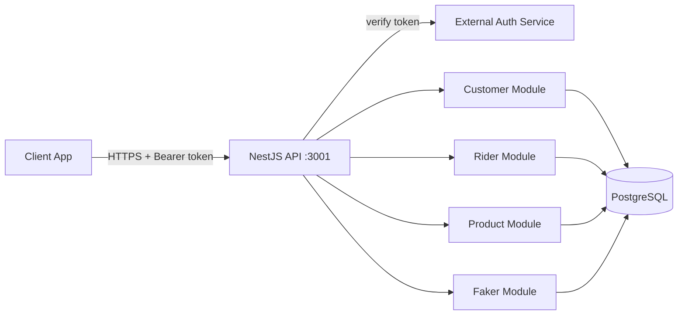

<div align="center">

# MoveToYou Backend


**A NestJS REST API for dairy delivery management: customers, riders, daily deliveries, products, routes, and delivery zones.**

</div>

> [!NOTE]
> This project is under active development. The API uses an external authentication service for token verification, and the database schema is auto-synchronized at runtime. Treat it as pre-1.0 software.

## Table of Contents

- [About](#about)
- [Features](#features)
- [Tech Stack](#tech-stack)
- [Architecture](#architecture)
- [Getting Started](#getting-started)
- [Key Endpoints](#key-endpoints)
- [Project Structure](#project-structure)
- [Configuration](#configuration)
- [Roadmap](#roadmap)
- [Contributing](#contributing)
- [License](#license)

## About

MoveToYou Backend is the server-side API for a dairy delivery management platform. It models the everyday work of a delivery business: keeping a list of customers, assigning them to riders, recording the daily deliveries each rider makes, tracking the products and quantities in each delivery, and organizing delivery areas into zones and routes.

The API is multi-tenant. Most data is scoped by an `organizationId`, so several dairy businesses can use the same backend while keeping their records separate. Authentication is delegated to an external service: the API does not issue its own tokens. Instead, protected routes extract the bearer token from the request and verify it by calling an external auth endpoint, then attach the returned user to the request.

The codebase is built with NestJS and TypeORM on top of PostgreSQL.

## Features

- Customer management with create, read, update, and soft-delete, scoped per organization.
- Rider workflows: daily deliveries, per-item delivery records, and route updates.
- Product catalog with prices, used as line items inside deliveries.
- Delivery areas and zones for organizing where riders deliver.
- Customer-to-rider assignment so each rider knows their customers.
- Invoice and receipt entities linked to customers and deliveries.
- External token verification through an auth service, with role-based access on admin routes.
- A faker module that seeds sample customers and products for development.

## Tech Stack

| Layer | Technology |
|-------|-----------|
| Framework | NestJS 10 |
| Language | TypeScript 5 |
| Database | PostgreSQL |
| ORM | TypeORM 0.3 |
| Config | @nestjs/config (env files) |
| HTTP client | @nestjs/axios |
| Validation | class-validator, class-transformer |
| Testing | Jest, Supertest |

## Architecture



The application boots from `src/main.ts`, enables CORS, and listens on port 3001. The root `AppModule` wires up TypeORM against PostgreSQL and imports the four feature modules. Protected routes use a JWT auth guard that calls an external service to verify the bearer token, plus a roles guard for admin-only endpoints.

## Getting Started

### Prerequisites

```bash
node -v   # Node.js 18 or newer recommended for NestJS 10
npm -v
# A running PostgreSQL instance
```

### Installation

```bash
git clone https://github.com/atiqbitstream/moveToYou-BEnd.git
cd moveToYou-BEnd
npm install
```

### Configure the environment

Create a `.local.env` file in the project root with your database settings (see [Configuration](#configuration)). The app reads this file at startup.

### Run

```bash
# development
npm run start

# watch mode (reloads on change)
npm run start:dev

# production (after building)
npm run build
npm run start:prod
```

The API starts on `http://localhost:3001`.

### Tests

```bash
npm run test       # unit tests
npm run test:e2e   # end-to-end tests
npm run test:cov   # coverage
```

## Key Endpoints

Base URL: `http://localhost:3001`

Routes marked Admin require a valid bearer token and the admin role. Routes marked Auth require a valid bearer token verified by the external auth service.

### Customer (`/customer`, Admin)

| Method | Path | Description |
|--------|------|-------------|
| POST | `/customer/create` | Create a customer |
| GET | `/customer/getCustomer` | Get a customer by id (query) |
| GET | `/customer/getAllCustomers` | List customers by organization (query) |
| PATCH | `/customer/update/:id` | Update a customer |
| DELETE | `/customer/delete/:id` | Delete a customer |
| GET | `/customer/verification` | User verification check |

### Rider (`/rider`)

| Method | Path | Auth | Description |
|--------|------|------|-------------|
| POST | `/rider/createDeliveryWithItem` | - | Create a daily delivery with items |
| POST | `/rider/createDailyDelivery` | Auth | Create a daily delivery |
| GET | `/rider/getDailyDelivery` | Auth | Get the rider's daily deliveries |
| GET | `/rider/getDailyDeliveryWithItems` | Auth | Get daily deliveries with items |
| PATCH | `/rider/updateDailyDelivery/:id` | - | Update a daily delivery |
| DELETE | `/rider/delete/dailyDelivery/:id` | - | Delete a daily delivery |
| POST | `/rider/createDeliveryItem` | - | Add a delivery item |
| GET | `/rider/getDeliveryItem` | - | Get items for a delivery |
| PATCH | `/rider/updateDeliveryItem/:id` | - | Update a delivery item |
| DELETE | `/rider/delete/deliveryItem/:id` | - | Delete a delivery item |
| PATCH | `/rider/updateRoutes` | Auth | Update the rider's routes |
| POST | `/rider/assignCustomer/:riderId` | - | Assign customers to a rider |
| GET | `/rider/getAssignedCustomers/:riderId` | - | List a rider's assigned customers |
| DELETE | `/rider/delete/assignedCustomer/:id` | - | Remove a customer assignment |
| POST | `/rider/createProduct` | - | Create a product |
| GET | `/rider/getProduct/:id` | - | Get a product |
| GET | `/rider/getAllProducts` | Auth | List products by organization |
| PATCH | `/rider/updateProduct/:id` | - | Update a product |
| DELETE | `/rider/delete/product/:id` | - | Delete a product |
| POST | `/rider/createArea` | - | Create a delivery area |
| GET | `/rider/getArea/:id` | - | Get an area |
| PATCH | `/rider/updateArea/:id` | - | Update an area |
| DELETE | `/rider/deleteArea/:id` | - | Delete an area |
| POST | `/rider/createZone` | - | Create a zone |
| GET | `/rider/getZone/:id` | - | Get a zone |
| PATCH | `/rider/updateZone/:id` | - | Update a zone |
| DELETE | `/rider/deleteZone/:id` | - | Delete a zone |

### Product (`/product`)

| Method | Path | Description |
|--------|------|-------------|
| GET | `/product` | List all products |
| GET | `/product/:id` | Get a product by id |
| DELETE | `/product/:id` | Delete a product |

### Faker (`/faker`)

| Method | Path | Description |
|--------|------|-------------|
| POST | `/faker/customers` | Seed sample customers |
| POST | `/faker/products` | Seed sample products |

## Project Structure

```text
src/
  app.module.ts          Root module: TypeORM + feature modules
  main.ts                Bootstrap, CORS, listens on port 3001
  customer/              Customers, invoices, receipts
    entities/            Customer, Invoice, Receipt
    services/            Customer and receipt services
  product/               Product catalog
    entities/            Product
  rider/                 Riders, deliveries, areas, zones, routes
    controllers/         Rider controller
    entities/            DailyDelivery, DeliveryItem, AssignCustomer, Area, Zone, Route
    services/            Rider service
    guards/              Roles guard
    decorators/          Roles decorator
  faker/                 Development data seeding
  shared/                Shared auth guard and external token service
test/                    End-to-end tests
```

## Configuration

The app loads environment variables from `.local.env` in the project root (configured in `app.module.ts`). Set these before running:

| Variable | Description | Default |
|----------|-------------|---------|
| `DB_HOST` | PostgreSQL host | none |
| `DB_PORT` | PostgreSQL port | none |
| `DB_USERNAME` | Database user | none |
| `DB_PASSWORD` | Database password | none |
| `DB_DATABASE` | Database name | none |
| `SNB_URL` | External auth service base URL used for token verification | none |

Notes:

- TypeORM runs with `synchronize: true`, so the schema is created and updated from the entities automatically. This is convenient in development but not safe for production data.
- Do not commit real credentials. Use a local, untracked env file. See the security note in the roadmap below.

## Roadmap

- [ ] Move secrets out of any committed env files and add them to `.gitignore`.
- [ ] Add a `.env.example` template with placeholder values.
- [ ] Make the external auth service URL come fully from `SNB_URL` (remove hardcoded fallback).
- [ ] Disable `synchronize` and add database migrations for production.
- [ ] Add API documentation (for example, Swagger).
- [ ] Apply consistent auth guards across all rider routes.

## Contributing

Contributions are welcome. Open an issue to discuss a change, then submit a pull request. Please run the linter and tests before pushing:

```bash
npm run lint
npm run test
```

## License

Distributed under the MIT License. See [LICENSE](LICENSE).
